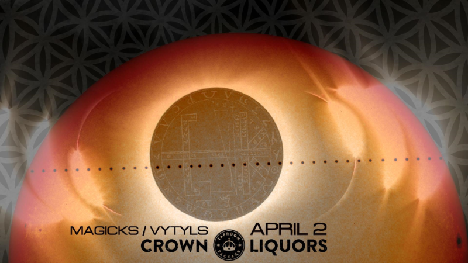

# Field Configuration Log: [VYT-007]

## <u>Specs</u>:

* **Date | Time**: [17.04.02]  [00:00:00]
* **Local Coordinates**: [41.93390590782234, -87.71330941391574]
* **System Duration**: [00:00:00]
* **Resonance Catalogue**: [Currently Unavailable] 

## <u>Evolution | Dynamics</u>:

| <u>Position</u> | <u>State \| Shift</u>    | <u>Length</u> |
| --------------- | ------------------------ | ------------- |
| 01              | [Currently Unavailable]  | 00:00         |

## <u>Corespondance</u>:

* **Visual Index**:  
* **Annotation**:
```

Magicks / Vytyls

```

---

*This log is part of the VYTYLS Praxis Archive. All audio is property of the Initiative.*