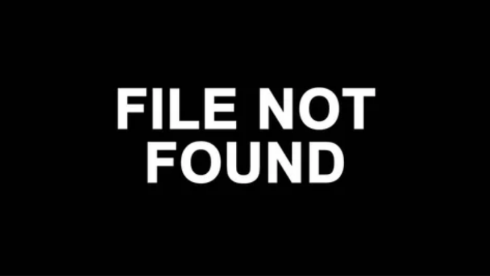

# Field Configuration Log: [VYT-010]

## <u>Specs</u>:

* **Date | Time**: [17.09.20]  [00:00:00]
* **Local Coordinates**: [41.85390260724297, -87.68245357476434]
* **System Duration**: [00:00:00]
* **Resonance Catalogue**: [Bandcamp] 

## <u>Evolution | Dynamics</u>:

| <u>Position</u> | <u>State \| Shift</u>          | <u>Length</u> |
| --------------- | ------------------------------ | ------------- |
| 01              | Netsimed_01_170920_StudioIC2   |               |
| 02              | Intouclint_02_170920_StudioIC2 |               |
| 03              | Gripped_03_170920_StudioIC2    |               |
| 04              | Sound150_04_170920_StudioIC2   |               |
| 05              | Amrbroqua_05_170920_StudioIC2  |               |
| 06              | End_06_170920_StudioIC2        |               |

## <u>Corespondance</u>:

* **Visual Index**: 
* **Annotation**:
```

Anything to note...
Do so here.

```

---

*This log is part of the VYTYLS Praxis Archive. All audio is property of the Initiative.*