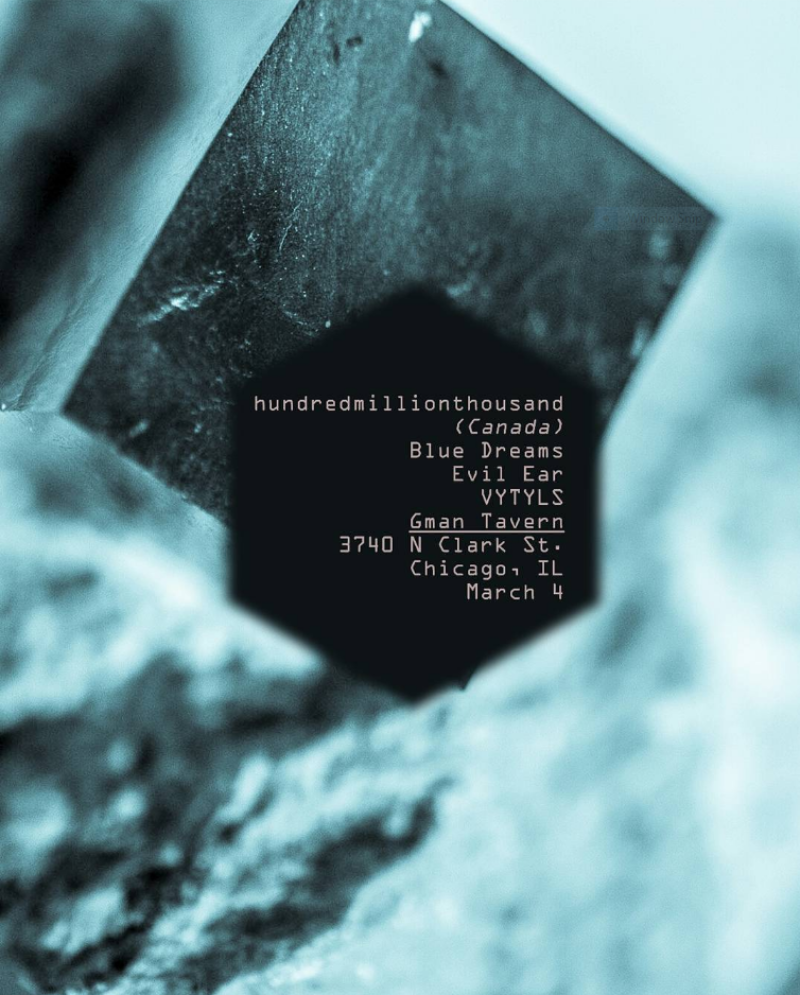

# Field Configuration Log: [VYT-014]

## <u>Specs</u>:

* **Date | Time**: [3/4/2018]  [00:00:00]
* **Local Coordinates**: [41.95071625952438, -87.6591182063808]
* **System Duration**: [00:00:00]
* **Resonance Catalogue**: [Currently Unavailable] 

## <u>Evolution | Dynamics</u>:

| <u>Position</u> | <u>State \| Shift</u>   | <u>Length</u> |
| --------------- | ----------------------- | ------------- |
| 01              | [Currently Unavailable] | 00:00         |

## <u>Corespondance</u>:

* **Visual Index**:  
* **Annotation**:
```

Hundredmillionthousand (CAN) / Evil Ear / Blue Dreams / Vytyls

```

---

*This log is part of the VYTYLS Praxis Archive. All audio is property of the Initiative.*