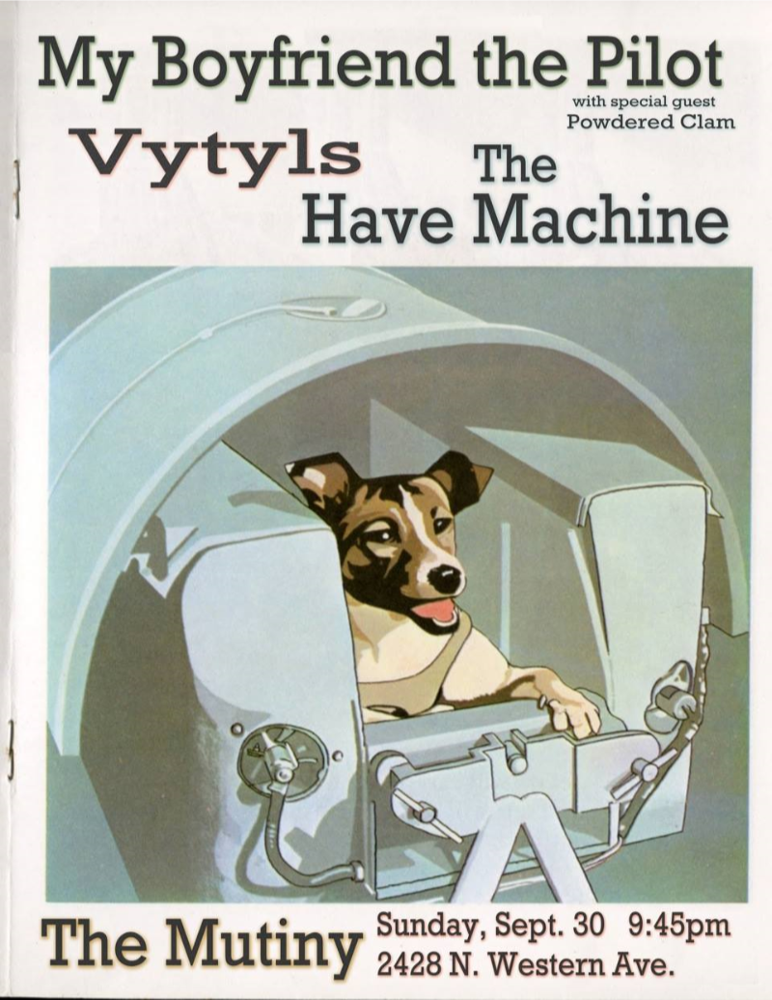

# Field Configuration Log: [VYT-016]

## <u>Specs</u>:

* **Date | Time**: [18.09.30]  [21:45:00]
* **Local Coordinates**: [41.92761802409943, -87.70403964500647]
* **System Duration**: [00:00:00]
* **Resonance Catalogue**: [Bandcamp] 

## <u>Evolution | Dynamics</u>:

| <u>Position</u> | <u>State \| Shift</u>       | <u>Length</u> |
| --------------- | --------------------------- | ------------- |
| 01              | Starton_01_180930_Mutiny    |               |
| 02              | Thisinest_02_180930_Mutiny  |               |
| 03              | Sound150_03_180930_Mutiny   |               |
| 04              | Intouclint_04_180930_Mutiny |               |

## <u>Corespondance</u>:

* **Visual Index**:  
* **Annotation**:
```

My Boyfriend the Pilot / Vytyls / The Have Machine

```

---

*This log is part of the VYTYLS Praxis Archive. All audio is property of the Initiative.*