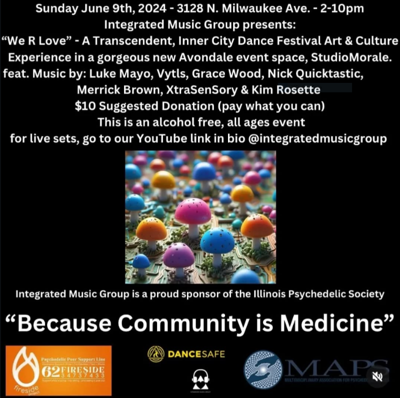

# Field Configuration Log: [VYT-021]

## <u>Specs</u>:

* **Date | Time**: [24.06.09]  [15:30:00]
* **Local Coordinates**: [41.93784724381875, -87.72202449791286]
* **System Duration**: [00:00:00]
* **Resonance Catalogue**: [Currently Unavailable] 

## <u>Evolution | Dynamics</u>:

| <u>Position</u> | <u>State \| Shift</u>   | <u>Length</u> |
| --------------- | ----------------------- | ------------- |
| 01              | [Currently Unavailable] | 00:00         |

## <u>Corespondance</u>:

* **Visual Index**:  
* **Annotation**:
```

Integrated Music Group - Luke Mayo / VYTYLS / Grace Wood / Nick Quicktastic / Merrick Brown / XtraSenSory / Kim Rosette

```

---

*This log is part of the VYTYLS Praxis Archive. All audio is property of the Initiative.*